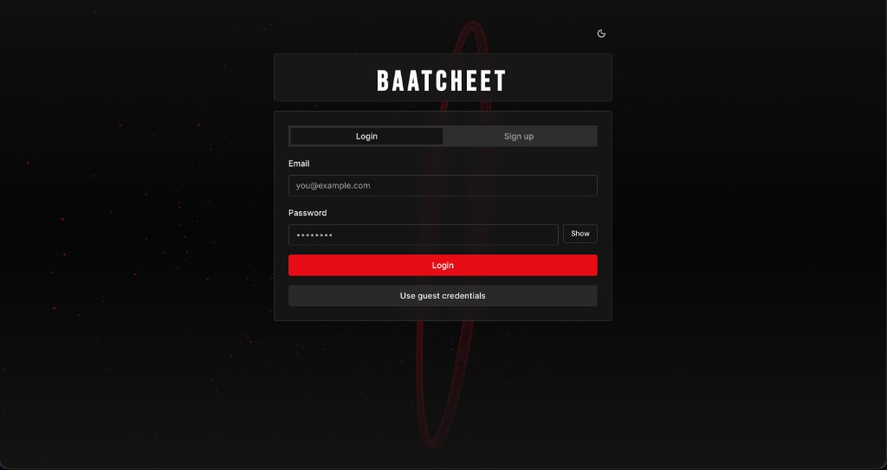
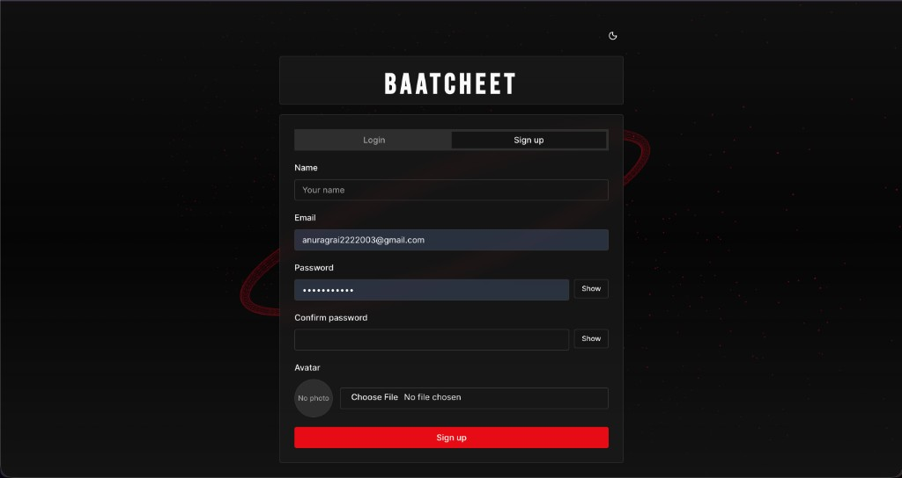
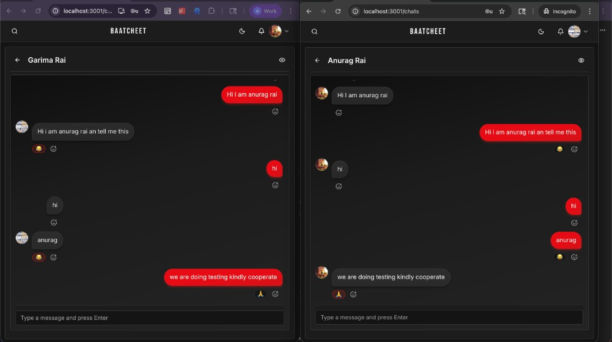
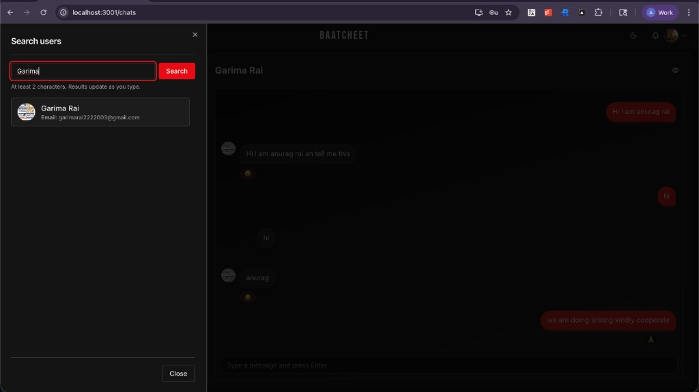
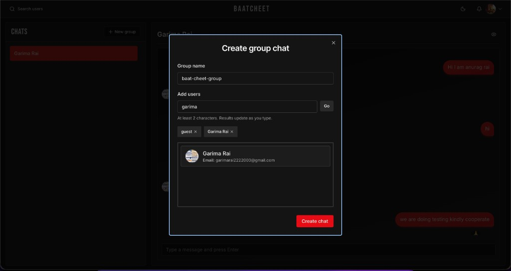
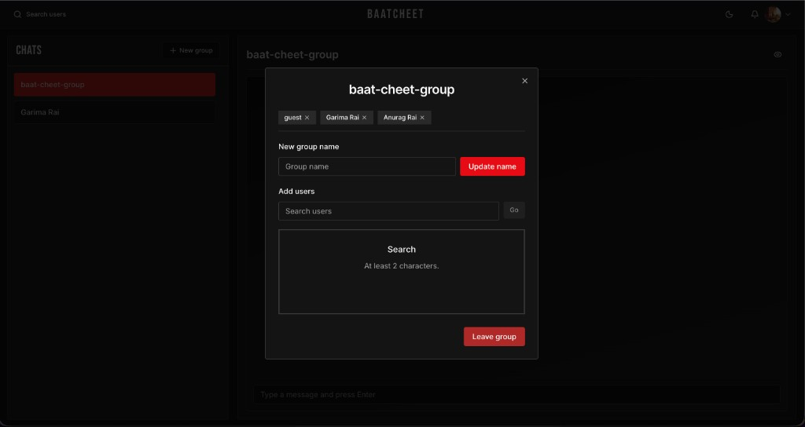
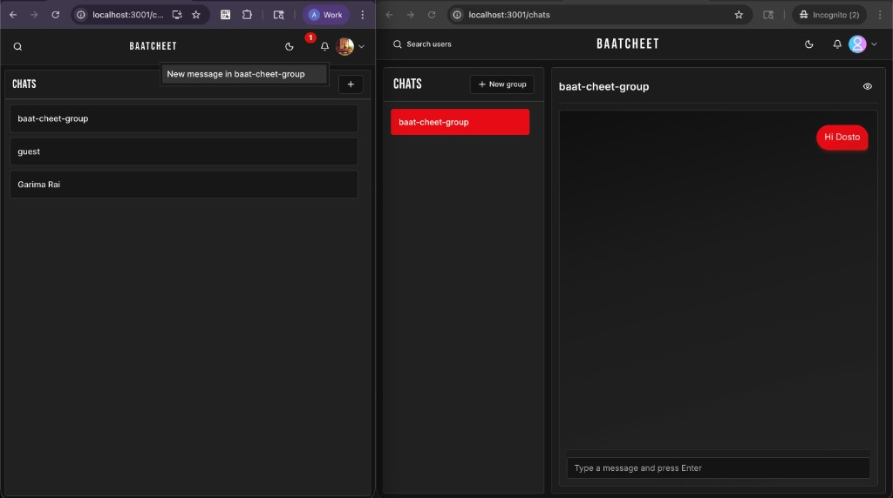

# BaatCheet

Real-time **MERN** chat with a dark, production-style UI: JWT auth, **Socket.io** messaging, **MongoDB** persistence, one-to-one and **group** conversations, user search, and live **notifications**.

---

## Features

| Area | What you get |
|------|----------------|
| **Login** | Email/password sign-in, optional guest credentials, password visibility toggle |
| **Sign up** | Registration with name, email, password confirmation, and **avatar** upload (Cloudinary) |
| **Chat section** | Sidebar chat list, active conversation view, sent/received bubbles, emoji reactions, Enter-to-send |
| **Search users** | Debounced search (min characters), results as you type, start chats from results |
| **Group chat** | Create groups, add/remove members, **rename** the group, **leave** group |
| **Notifications** | Bell with badge, in-app alerts for new messages (e.g. new activity in a group) |

---

## Screenshots

### Login

### Sign up

### Chat & real-time messaging

### Search users

### Create group chat

### Group management (add / remove / update / leave)

### Notifications

---

## Tech stack

- **Frontend:** React, React Router, Socket.io client, Axios, Tailwind-style UI (shadcn-style components), theme toggle (dark/light)
- **Backend:** Node.js, Express, Socket.io, Mongoose (MongoDB)
- **Auth:** JWT, bcrypt
- **Optional:** Docker Compose for MongoDB + API (see `docker-compose.yml`)

---

## Quick start (local)

1. **MongoDB** running locally (or use `docker compose up` for the bundled stack).
2. **Backend:** from repo root, configure `.env` (e.g. `MONGO_URI`, `JWT_SECRET`), then `npm install` and `npm start`.
3. **Frontend:** `cd frontend && npm install && npm start` (set API/Socket base URL if not using the default proxy).

Adjust ports and env vars to match your machine; the UI in the screenshots uses the main chats route after login.

---

## License

ISC (see repository metadata).
